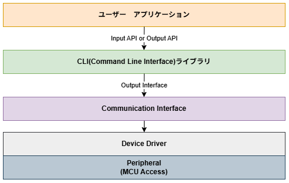

# 概要設計 CLIライブラリ
CLI(Command Line Interface)ライブラリの概要設計について記載する。  


## 目次

1. [文書情報](#文書情報)
2. [概要](#概要)
3. [設計方針](#設計方針)
4. [システム構成](#システム構成)
5. [ソフトウェア構成](#ソフトウェア構成)
6. [モジュール構成](#モジュール構成)
7. [データ構成](#データ構成)
8. [公開API](#公開API)
9. [制約事項](#制約事項)


## 文書情報

---


## 概要
CLIは、マイコン等の組み込み機器を対象に、テキストベースで動作指令を可能とするCUI(character user interface)ライクなライブラリである。  


---


## 設計方針
- 動的メモリ（malloc/free）の使用は禁止
- 公開データは、制御に必要な内部データを隠蔽するため不透明型を採用する
- CLIが提供するAPIは初期化が完了後のみ利用可能とする

---


## システム構成
システム構成図を以下に示す。  


---

## ソフトウェア構成
ソフトウェア構成図を以下に示す。  


---

## モジュール構成

---

## データ構成
外部公開するデータ構造について説明する。  

データ構造は不透明型を採用し、制御に必要なデータは隠蔽する。  
また、初期化時に任意の設定が必要なデータに関しては別途データ構造を定義する。  

### 公開データ
```h
typedef struct
{
    /* 不透明型を採用し、データ領域は64byteを確保する */
    uint8_t opaque[64]:
} cli_handle_t;

typedef struct
{
    /* ユーザーが個別に設定するデータを定義 */
    /* コールバック */
    /* ワークバッファ等... */
} cli_config_t;
```

---


## 公開API

---

## 制約事項

---