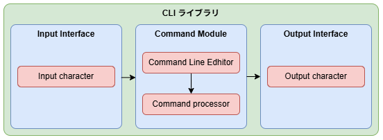
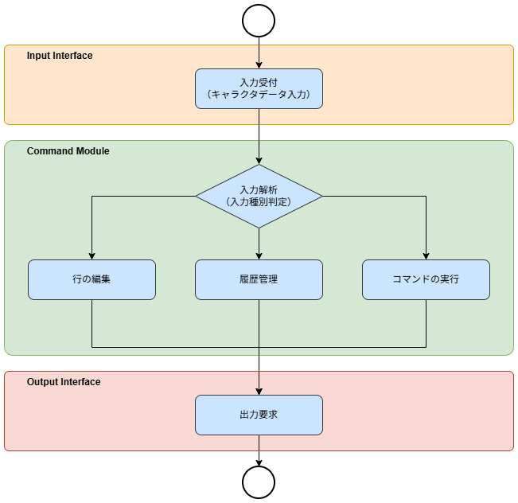

# 概要設計
## 目次

1. [概要](#概要)
2. [適用構成](#適用構成)
3. [要求仕様](#要求仕様)
4. [ソフトウェア構成](#ソフトウェア構成)
5. [モジュール概要](#モジュール概要)

## 概要
CLIライブラリは、入力された文字列を解析し、コマンド実行および結果表示を行うライブラリである。  

WindowsやLinux等で使われているshellの仕組み・機能をマイコン等の組み込み機器向けに提供する。  
本ライブラリは入出力デバイスには依存せず、UART、USB、BLE等の通信手段やLCD等の表示装置へ適用できることを目的とする。  


CLIライブラリの責務は以下とする。  
- 入力データ解析
- コマンドラインの編集
- コマンド実行
- 解析・実行結果の出力

以下は責務外とする。  
- 入力・出力デバイス制御

---


## 適用構成

- ターミナルソフトを使用する場合の構成例
```text
入力デバイス(キーボード)
↓
入力モジュール(UART)
↓
CLIライブラリ
↓
出力モジュール(UART)
↓
出力デバイス(ターミナルソフトのコンソール画面)
```


- LCDを使用する場合の構成例
```text
入力デバイス(キーボード)
↓
入力モジュール(USB HID)
↓
CLIライブラリ
↓
出力モジュール(LCDデバイスドライバ)
↓
出力デバイス(LCDに描画)
```


## 要求仕様
本ライブラリが、要求する機能を以下に記載する。  

- 動的メモリ未使用
- マルチインスタンス対応
- 入出力デバイス非依存
- リアルタイムOS必須ではない
- コマンド編集機能を有する
- コマンド履歴機能を有する
- コマンド登録機能を有する
- printf形式出力を提供する
- ASCII文字を対象とする
- UTF-8等の多バイト文字は対象外

---


## ソフトウェア構成
本ライブラリは目的に応じた複数の機能により構成される。  

- `Input Interface` -入力データをCLIライブラリへ受け渡すインターフェース
- `Command Module` -CLIの業務ロジックを提供する
- `Output Interface` -CLIが生成したデータを外部へ出力する


ソフトウェア構成図を以下に示す。  



---


## モジュール概要
モジュール間の関連を示した処理フローを以下に示す。  



---

### Input Interface
入力モジュールが受け取ったキャラクタデータをCLIライブラリに入力するためのインターフェースを提供する。  

#### 提供機能
- 入力受付

#### 公開API
- `cli_input_char`

---


### Command Module
入力データの解析、コマンドライン編集、コマンド実行等の業務ロジックを担当する。  

#### 提供機能
- CLIの主制御
- 行の編集
- 履歴管理
- コマンドの登録
- コマンドの実行

#### 公開API
- `cli_init`
- `cli_handler`
- `cli_cmd_register`
- `cli_cmd_unregister`

---


### Output Interface
CLIライブラリが生成した文字列データを外部へ出力するためのインターフェースを提供する。  

#### 提供機能
- 文字列出力
- printf出力

#### 公開API
- `cli_write`
- `cli_printf`
- `cli_vprintf`
- `cli_putc`

---